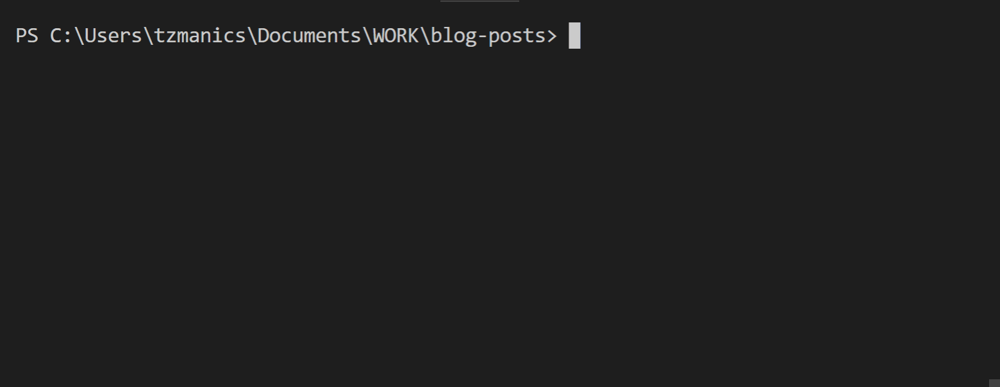
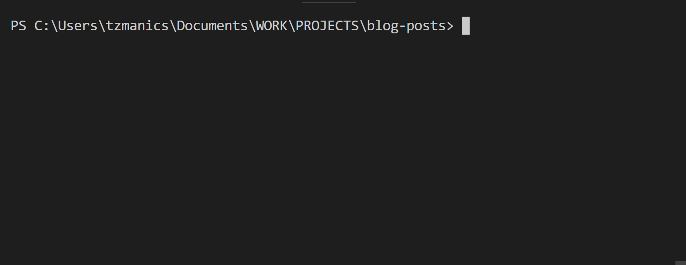
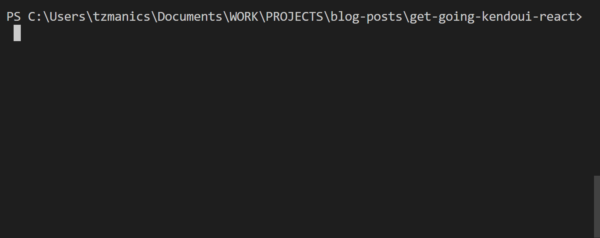
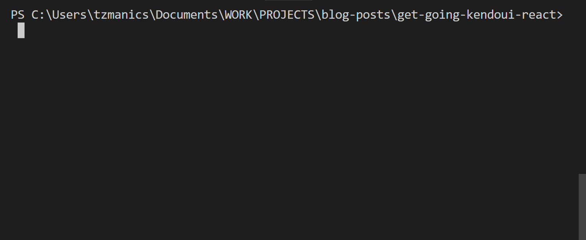
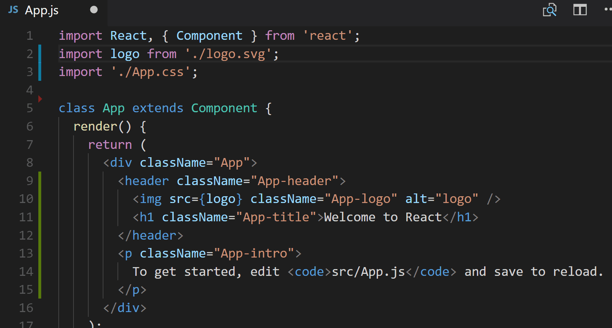
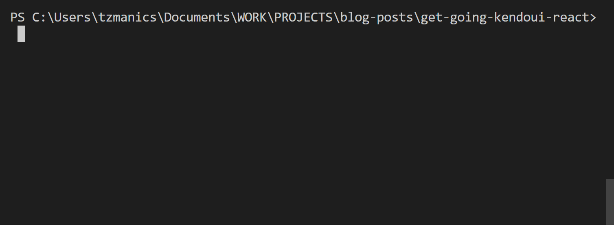
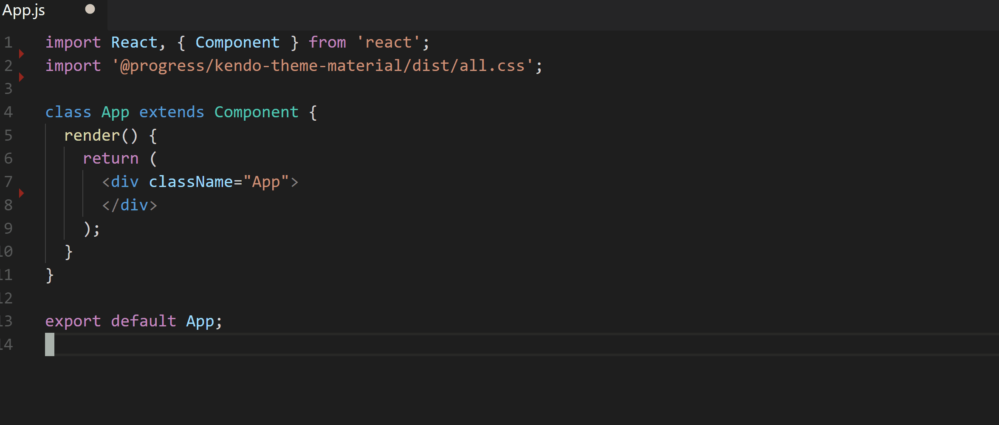
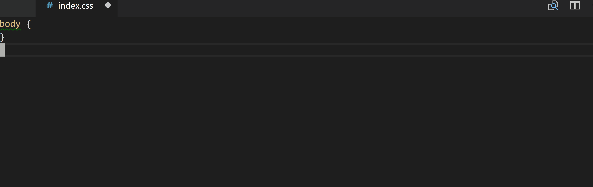
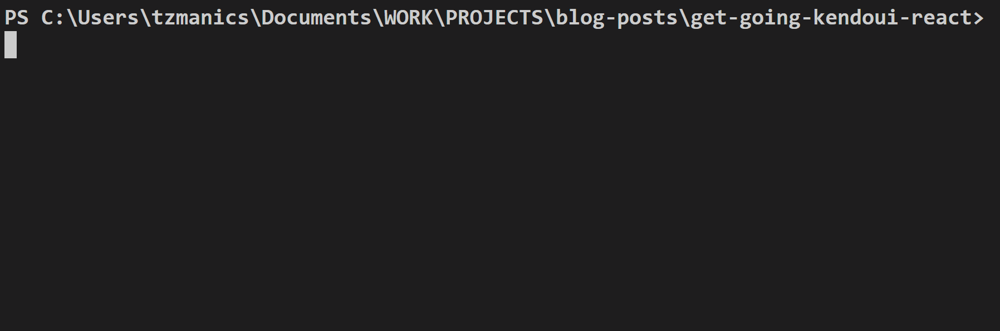
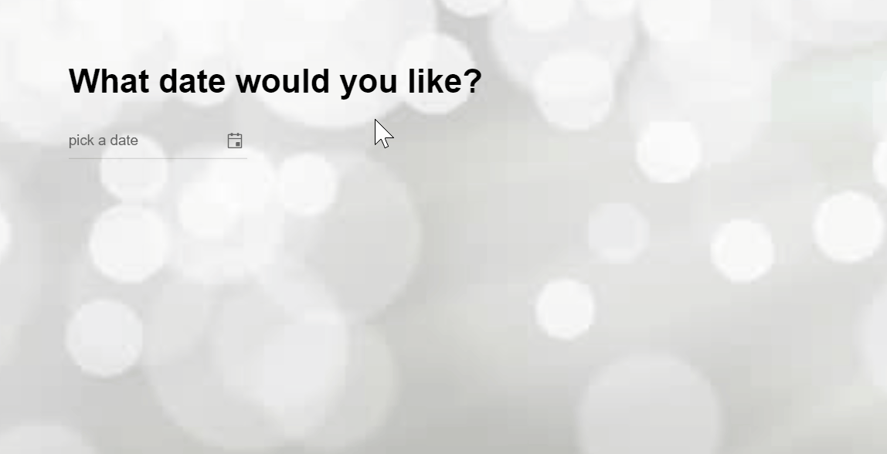

# Gif Guide
## Get Going with Kendo UI & React

I am extremely excited to announce our new wrappers for React.js! To help you get started I'm going to walk through how to get setup and create a React application with a date picker. Here's what we'll be covering:

- Installing & creating a React app with [`create-react-app`](https://github.com/facebookincubator/create-react-app)
- Installing [Kendo UI components](https://www.telerik.com/kendo-react-ui)
- Adding Kendo UI [Material styling](https://www.telerik.com/kendo-angular-ui/components/styling/theme-material/)
- Implementing a Kendo UI `Datepicker` component
- Where to go next :)

### Creating A React App

First, we need to create a React app with the aptly named [`create-react-app`](https://github.com/facebookincubator/create-react-app) library by first installing the module with the `-g` flag to install it globally.

```bash
npm install create-react-app -g
```


Now, we can head to the directory where we want our project to live. Since we globally installed `create-react-app` we can just run `create-react-app <project name here>`.

```bash
create-react-app get-going-kendoui-react
```



In order to track our changes and have a good place to get back to if things go awry, we'll add git to version control our project by going into the project directory and running `git init`. Then we add all the new files by running `git add .` and assign a remote repo on Github.com with the command `git remote add origin <url to repo>`. I had already created an empty repository on GitHub, you can check out how to do that [here](https://help.github.com/articles/create-a-repo/) or do it on [GitLab](https://docs.gitlab.com/ee/gitlab-basics/create-project.html). Once we have our repo set up we can make a commit for these files, `git commit`, edit the commit message, then push our changes to the repo on GitHub, `git push origin master`.


Yay, we have a safety net! The project listed here is also going to be our example project that we can follow along with each code change we make in this post. At the end of each section that we change some code, look for the 🐙 emoji to find the link to the commit and see what was changed.

For instance:

🐙[Link to creating a react app commit.](https://github.com/tzmanics/gif-guide_get-going-kendoui-react/commit/fe66b99e9def08a7a8f0e5831767da55626b9e8e)

### Installing The Helpers

Alright, now we're cooking with gas! There are a few libraries that will help us build our robust, React app, so let's use npm to install those now. First, we install the Kendo UI library by running

```bash
npm i @progress/kendo-ui
```

Since we're using the latest version of [`npm`](https://www.npmjs.com/) (`v5.5.1` at the time of this post), we don't need the `--save` flag to make sure this module is saved as one of our dependencies, `npm` does that by default.



#### Adding Styling

Now, on to one of my favorite helpers of all: [Kendo UI default themes](https://docs.telerik.com/kendo-ui/styles-and-layout/sass-themes)!! CSS is hard, thankfully Kendo UI has theme libraries to help take care of making things look good. Today, we'll be using the Kendo UI Material theme library (you can find all the variables for customizing [here](https://www.telerik.com/kendo-angular-ui/components/styling/theme-material/customization/)). To install it we just need to use npm:

```bash
npm i @progress/kendo-theme-material
```



To include the styling in our application we just need to edit the `src/App.js` file. Inside there we'll delete some old styling and import the Kendo UI Material theme files.



🐙 [Link to the installing the helpers & adding styling commit.](https://github.com/tzmanics/gif-guide_get-going-kendoui-react/commit/bbd8b6be082809a1491739389eaf94db89c838b8)


### Adding Kendo UI Components

On to the easy part: adding a date picker! I know, not usually the easy part, but that's why Kendo UI is so handy. Here we're adding the [DatePicker](https://demos.telerik.com/kendo-react-ui/wrappers/datepicker/index) but these are the same main steps we will take with any Kendo UI component:
1. Use npm to install the module.
2. Import the component we want.
3. Add the component to the template and assign its parameters & events.

Here we go 😃 First, we use npm to install the Kendo UI.

```bash
npm i @progress/kendo-dateinputs-react-wrapper
```



Once we have that installed we can open up the main `src/App.js` file to add our DatePicker component. You can see here when we import the component we specifically asked for the `DatePicker`. The `kendo-dateinputs-react-wrapper` module also includes the [Calendar](https://docs.telerik.com/kendo-ui-wrappers-react/components/calendar), [DateInput](https://docs.telerik.com/kendo-ui-wrappers-react/components/dateinput), [DateTimePicker](https://docs.telerik.com/kendo-ui-wrappers-react/components/datetimepicker) and [TimePicker](https://docs.telerik.com/kendo-ui-wrappers-react/components/timepicker) components, but we only need the `DatePicker` today. The next piece we want to import is the `kendo-ui` library that we installed earlier. Once we have all our pieces imported we can add what we need to the actual template part of the `App.js` file. 

In the template we first add a header that we'll use to prompt the user. Then we can open up the `DatePicker` component and start assigning some of the component's attributes:
- `value`: The default value inside the DatePicker's text box before the user chooses a date.
- `min`: The minimum date the value can be set to.
- `max`: The maximum date the value can be set to.
- `format`: The way you would like the date to be displayed.




🐙 [Link to the adding Kendo UI components commit.](https://github.com/tzmanics/gif-guide_get-going-kendoui-react/commit/74dbfba0ffbff4d1ee7e16976cbcfcf001e4367c)

### A Lil' More Stylin'

All the styling for the DatePicker component has (thankfully) been handled with the inclusion of the Kendo UI Material theme. Just to add a little extra I've added a background image, assigned a `font-family` and added some margins. 



#### Let's take a Look 👁!
Now that we've added our component and a little more styling, let's take a look at what we have. To run the React application locally we can just run `npm start` from the directory our project is in. If we take a look at the project's `package.json` file we can see that the script for `npm start` is 

```json
...
  "scripts": {
    "start": "react-scripts start",
...
 ```



 This is one of the scripts in the `create-react-app` package `react-scripts`. Feel free to dig in more [here](https://github.com/facebookincubator/create-react-app/tree/master/packages/react-scripts). Basically, this script will run the app in development mode where you can preview it at `http://localhost:3000`, making it so you can see linting errors in the console and, if you keep it running, it will reload the page if you make any changes.


✨Ta-da✨ It's a lovely date picker! You can see here that the Material styling has been placed on our date picker and all we had to do was import the style files in the main `src/App.js` file. Notice that when a date is picked the text field is updated, this is the default reaction to the component's `change` event. You can check out more about the `DatePicker`'s events [here](https://docs.telerik.com/kendo-ui/api/javascript/ui/datepicker#events).



🐙 [Link to the commit for adding a lil' more stylin'.](https://github.com/tzmanics/gif-guide_get-going-kendoui-react/commit/6b759ee0e757ff8bea49c22656a064781631a6aa)

### Where to go Next 
You did it! If you followed along you now have a running React app using a Kendo UI DatePicker component. Now you can check out all the [other components](https://docs.telerik.com/kendo-ui-wrappers-react/introduction) and see which ones work best for you. Here are some other resources that will help you with your next steps too!

Resources:
- [🐙 Example Project Repo (all the code!)](https://github.com/tzmanics/gif-guide_get-going-kendoui-react)
- [Kendo UI for React.js Getting Started Guide](https://www.telerik.com/kendo-react-ui/getting-started-react)
- [Application Dashboard Example](https://demos.telerik.com/kendo-react-ui/wrappers)
- [Kendo UI React.js Wrapper Demos](https://demos.telerik.com/kendo-react-ui/wrappers)

Always feel free to reach out to us on Twitter [@KendoUI](https://twitter.com/KendoUI). Thanks so much for coding with me, I can't wait to see all the awesome projects you create! 👋😃